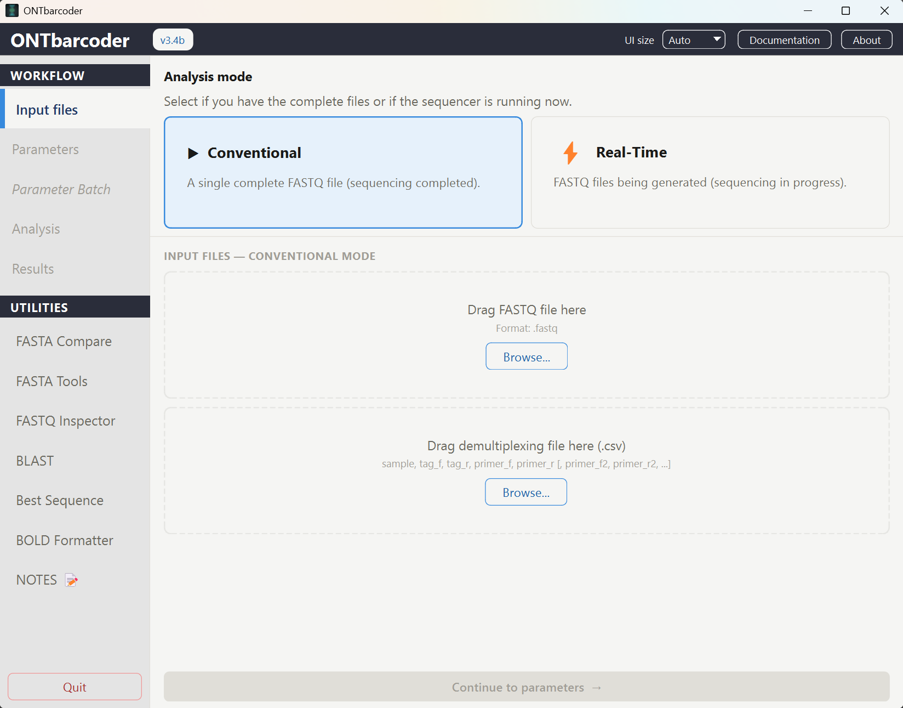
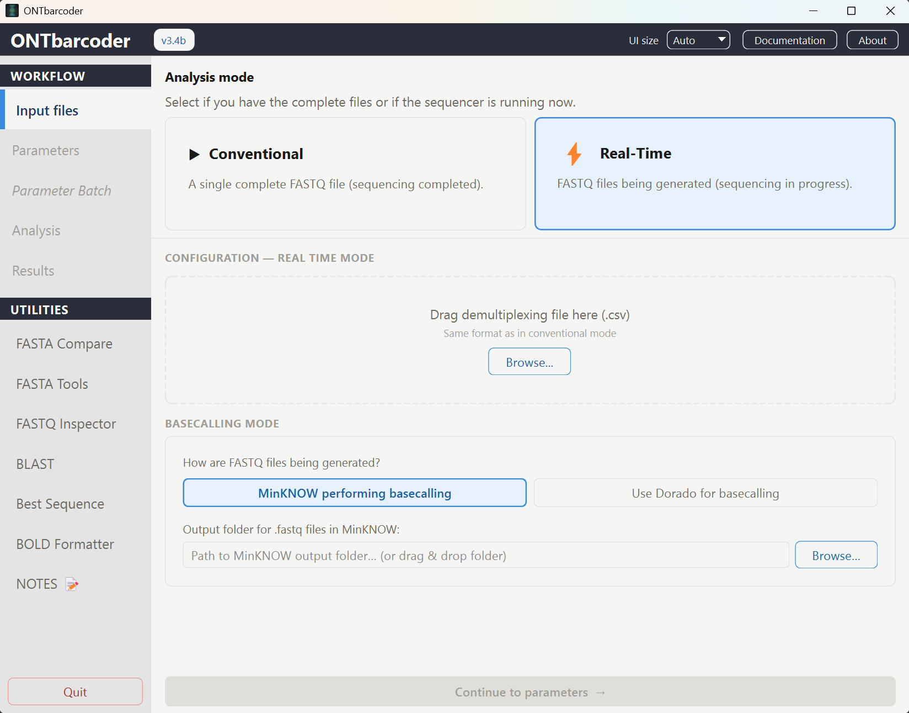

# ONTbarcoder v3

Desktop tool for demultiplexing and analysis of **Oxford Nanopore (ONT)** reads
using DNA barcodes.

This is a fork / version-3 rewrite of **ONTbarcoder 2.0**
(Srivathsan et al. 2024, *Cladistics* 40: 192–203,
<https://doi.org/10.1111/cla.12566>). The barcode-calling algorithm is unchanged;
version 3 rebuilds the interface, ports the pipeline to Python 3 with
deterministic multiprocessing, and adds a set of analysis tools (BLAST, FASTA
Compare, FASTA Tools, FASTQ Inspector, Notes) plus a non-coding marker mode.

See [`CHANGELOG.md`](CHANGELOG.md) for the full list of differences from the
original.

## Screenshots

| Conventional mode | Real-time mode |
| :---: | :---: |
|  |  |
| Single completed FASTQ file | FASTQ files generated live during sequencing |

## Releases (ready-to-run executables)

Prebuilt bundles are published on the **[Releases](../../releases)** page — no
Python install needed:

| Platform | Asset                        |
| -------- | ---------------------------- |
| Windows  | `ONTbarcoder3_win.zip`       |
| Linux    | `ONTbarcoder3_linux.tar.gz`  |

Unpack and run the `ONTbarcoder3` executable.

## Running from source

```bash
python -m venv .venv
# Windows: .venv\Scripts\activate    |    Linux/macOS: source .venv/bin/activate
pip install -r requirements.txt
python ONTbarcoder3.py
```

Requires Python 3.11+ (tested on 3.13). For real-time barcoding you also need
**Dorado** and the **POD5** tooling installed and on `PATH`.

## Project layout

```
ONTbarcoder3.py          Main application / GUI
_utilities/              Worker pipeline + tool panels
  pipeline.py            Deterministic multiprocessing worker pipeline
  best_seq_panel.py / blast_panel.py / compare_panel.py /
  fasta_tools.py / fastq_inspector.py / notes_panel.py / shared.py
  orf_trim_fasta.py      CLI: trim coding barcodes to their ORF
_mafftfiles/             Bundled MAFFT (disttbfast) + parameter files
_profiles/               Saved parameter profiles + BLAST config (git-ignored)
_notes/                  Markdown notes shown in the Notes panel
guide/                   User manual (HTML) + screenshots
icon.ico                 Application icon

ONTbarcoder3.spec        PyInstaller recipe — Windows
ONTbarcoder3_linux.spec  PyInstaller recipe — Linux
build_linux.sh           Linux build driver (runs PyInstaller, assembles the
                         bundle, produces dist/ONTbarcoder3.tar.gz)
build_linux_docker.sh    Same build inside a manylinux container
linux/                   Linux packaging assets
  launch.sh              Launcher: checks the Qt/xcb prerequisites first
  install.sh             Desktop-entry installer
  icon.svg / ONTbarcoder3.desktop.in
```

## Building the executables

Both platforms build from the *same* sources; only the spec and the bundled
MAFFT binary differ (`_mafftfiles/disttbfast.exe` vs `_mafftfiles/disttbfast`).
Build each one on its own platform — PyInstaller does not cross-compile.

```bash
# Windows
pyinstaller ONTbarcoder3.spec          # -> dist/ONTbarcoder3/

# Linux
./build_linux.sh                       # -> dist/ONTbarcoder3.tar.gz
```

The specs collect the whole `_utilities` package rather than listing panels one
by one, so a newly added panel cannot be silently left out of the bundle.


## Credits

- **Original software:** Amrita Srivathsan, V. Feng, D. Suárez, B. Emerson &
  R. Meier — *ONTbarcoder 2.0*.
- **Version 3 development:** Eduardo Tovar Luque — Instituto Humboldt, 2026.

## License

Licensed under the **GNU General Public License v3.0** — see [`LICENSE`](LICENSE).
As a derivative of ONTbarcoder 2.0, this fork keeps the upstream copyleft terms.
